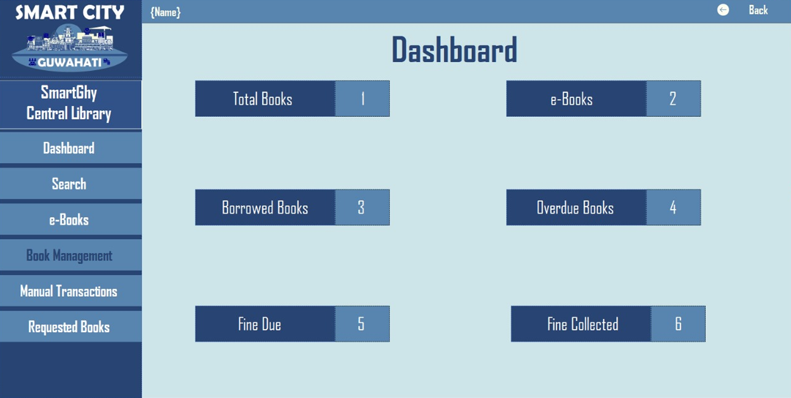

---

# Central Library Management System

Welcome to the Central Library Management System, part of the SmartGhy Smart City Management System for Guwahati (Group 2A). This modern library management system is designed to streamline the management of a library’s resources and provide an efficient way for both administrators and users to manage and access library services. 

## Table of Contents
1. [Introduction](#introduction)
2. [Features](#features)
   - [Admin Features](#admin-features)
   - [User Features](#user-features)
3. [Technologies Used](#technologies-used)
4. [Usage](#usage)
5. [Contributors](#contributors)

## Introduction
The Central Library Management System aims to address the challenges faced by both library administrators and users in managing and accessing library resources. Whether it's tracking overdue books, managing requests for unavailable books, or enabling users to access a wide range of e-books, this system modernizes and streamlines the entire process. This system offers features for both administrators (admins) and users, ensuring that the library is managed efficiently while users can easily access the resources they need.

## Features

### Admin Features
The admin panel provides comprehensive tools for managing the library, its resources, and user interactions.

1. **Dashboard**
   - An overview of key statistics related to the library system, including:
     - Total books in the library
     - Borrowed books
     - Overdue books
     - Fines due and fines collected
   
     
2. **Requested Books**
   - View all books requested by users for issue.
   - Admin can check if a book was previously issued and decide whether to approve or deny the current request.

3. **Book Management**
   - **Add Book:** Add a new book to the library database using the provided book details.
   - **Update Book:** Modify the details of an existing book by specifying the book ID.
   - **Remove Book:** Remove a book from the library database by specifying the book ID.
   

4. **Manual Transaction**
   - **Issue Book:** Issue a book to a user by specifying the book ID and user ID.
   - **Return Book:** Return a book to the library by specifying the book ID and user ID.
   - **Renew Book:** Renew a book for a user by specifying the book ID and user ID.
   - **Pay Fine:** Deduct a fine from a user's balance.
   - **Add Money to Balance:** Add funds to a user's balance.
     

### User Features
The user portal provides an intuitive interface for library patrons to manage their interactions with the library.

1. **Overdue Books**
   - View a list of books that the user has borrowed but not returned within the specified timeframe.
   - Acts as a reminder to return borrowed items promptly to avoid late fees or penalties.
     

2. **Search Books**
   - Users can search for specific books in the library’s collection using various search criteria, such as title, author, genre, or keywords.
     

3. **E-Books**
   - Access a digital library of e-books, enabling users to read electronic versions of books on different devices.
   - Expands access to literature and educational resources beyond the physical library.
   

4. **Borrowed Books**
   - Track borrowed books with details such as titles, due dates, and status.
   - Helps users manage their borrowing activities efficiently and return books on time.

5. **Requested Books**
   - Users can request unavailable or high-demand books.
   - Submitting a request allows the library to prioritize acquisitions and fulfill user demands, enhancing the overall user experience.

## Technologies Used
The Central Library Management System was built using the following technologies:
- **Development:** Visual Basic
- **Database:** MySQL

## Usage
- **Admin Login:** Admins can log in to the admin panel to manage books, transactions, and user requests.
- **User Registration/Login:** Users can register or log in to access their dashboard, search books, and manage borrowed books.
  
## Contributors
This project was developed by Group 2A as part of the SmartGhy Smart City Management System for Guwahati. 

- [Gautam Juneja (210101041)](https://github.com/HarmlessCoder)
- [Gaurav (210101040)](https://github.com/contributor2-username)
- [Hemant Yadav](https://github.com/contributor3-username)

---
