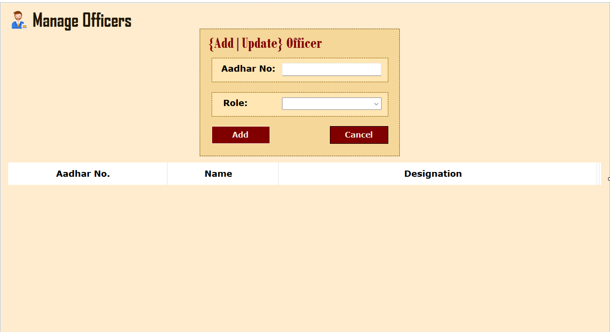
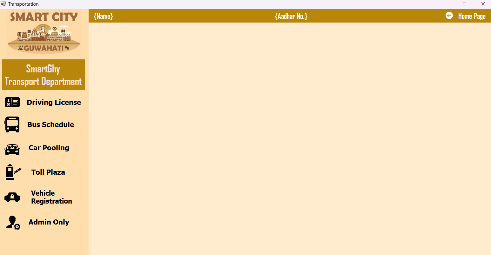
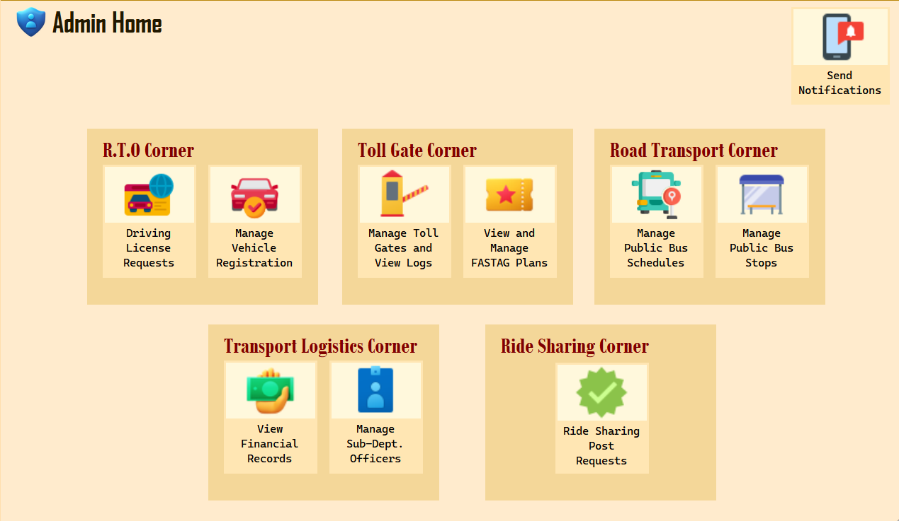

# InnerScreenTemplate:

Use it for making inner screen of every module like this example:

# Dashboard-New

Use it for making main dashboard of each module like this example:

# HomePageTemplate

Use it for making homepage for eg Admin of every module or main homepage module when u cant fit everything in dashbaord itself, like this one:

# Note
1. Add icons appropriately from `icons8` website
2. Please dont change the size of form and follow the template strictly.
3. **IMPORTANT** Also to ensure uniform dpi make this temporary change in your laptop
- Go to registry editor, hkey local user, control panel, then desktop then in right side look for Win8Dpiscaling
- Make that register hex value as 1
- Then right click, new DWORD and give the name LogPixels and give it hex value 78 and save it
- Restart your PC